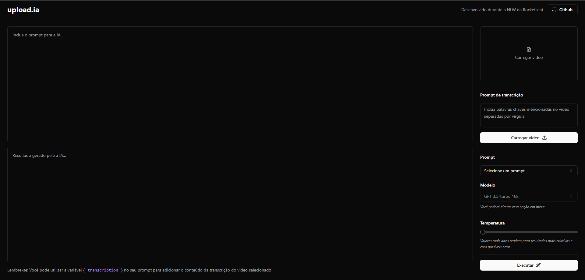

## Templates personalizados com AI

  

Comandos para executar a aplicação:
 
`
pnpm install
`
> Instala as dependêmcias

`
pnpm run dev
`

> Rodar a aplicação e o servidor

#### O modelo da pasta `.env` deve serguir:

`
  OPENAI_KEY="codigo da sua chave gerada no site da Openai"
`
[Openai para gerar a key](https://platform.openai.com/overview)
